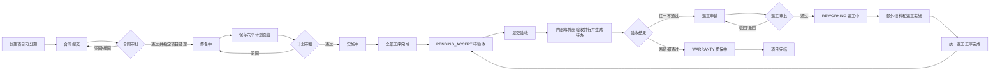

# 项目全流程与返工后端联调评审稿

> 文档状态：已确认联调口径
>
> 更新日期：2026-09-10
>
> 主要读者：产品、前端、后端、测试和实施负责人

## 1. 最终确认结论

1. 项目业务继续以 `periodId` 为分期边界。
2. 当前轮全部工序完成后，后端自动进入 `PENDING_ACCEPT`（待验收），由有权限人员显式“提交验收”。
3. 每轮验收固定包含内部和外部两条并行验收；提交后进入 `ACCEPTING` 并生成两条待办。内部验收由运维部门经理办理，外部验收（接口值 `CUSTOMER`）由本项目经理办理；两项都通过后端才自动进入 `WARRANTY`。
4. 任一验收不通过可申请返工，来源失败验收通过 `sourceAcceptanceId` 追溯。
5. 每张返工单统一为**一个返工工序**，保存请求只传一个 `process` 对象，不传多工序数组。
6. 返工用料只记录本轮需要**额外领料**的数量，现场已有余料不重复申请。
7. 后端不新增独立实施批次或验收轮次 ID，统一用 `reworkId` 关联返工工序、额外领料、领料申请、实施日志和再次验收；首次施工的 `reworkId` 为空。
8. 返工编辑、提交、撤回、审批全部使用详情接口刚返回的最新 `version` 做乐观锁校验；旧 version 必须拒绝。
9. 返工获批后生成普通项目工序，执行继续复用实施管理；完成唯一返工工序后回到 `PENDING_ACCEPT`，再携带当前 `reworkId` 提交复验。

## 2. 总体项目流程



### 2.1 项目创建与合同

- 创建主项目或已有主项目下新增分期，后续所有业务使用接口返回的 `periodId`。
- 合同和回款计划组合提交；项目金额、计划交付日期和质保期必填。
- 合同审批状态使用统一五态；通过时指定项目经理并进入 `PREPARING`。

### 2.2 计划方案

项目经理分别保存方案文件、用料计划、人员配置、实施计划、实施位置和回款计划。所有页签加载成功、校验通过且无未保存内容后，才允许提交计划审批。计划通过后进入 `IMPLEMENTING`。

### 2.3 实施与物料

- 首次实施和返工实施都使用普通项目工序及实施日志能力。
- 工序状态为 `NOT_STARTED / IN_PROGRESS / COMPLETED`。
- 普通项目领料读取 `/project/materialAccount/page` 的 `availableApplyQty`。
- 返工领料读取 `/project/rework/materials` 的本轮 `availableApplyQty`，提交出库申请时带 `reworkId`。
- 审批领料与实际出库是两个步骤；审批不会自动出库。

### 2.4 验收、返工与复验

- 当前轮工序全部完成后，由后端把分期推进为 `PENDING_ACCEPT`。
- `POST /project/acceptance/submit` 一次创建内部和外部两条验收，推进 `ACCEPTING`，并分别给运维部门经理和本项目经理创建待办。
- 两条验收可任意顺序开始和完成；失败时必须填写原因。
- 两项都 `PASSED` 后端自动进入 `WARRANTY`，前端不提供手工“进入质保”。
- 任一项 `FAILED` 后可基于该条验收创建返工草稿。
- 返工审批通过后生成一条普通工序并进入 `REWORKING`。
- 返工完成后携带当前 `reworkId` 重新提交内部和外部验收，历史记录不覆盖。

## 3. 核心状态

### 3.1 通用审批状态

| 值 | 文案 |
| ---: | --- |
| `-1` | 待提交 |
| `0` | 驳回 |
| `1` | 审核通过 |
| `2` | 待审批 |
| `3` | 已撤回 |

返工申请使用该审批状态；项目生命周期、验收结果、工序执行状态不能套用该编码。

### 3.2 项目关键状态

| 状态 | 说明 |
| --- | --- |
| `IMPLEMENTING` | 首次实施中 |
| `PENDING_ACCEPT` | 当前轮工序已完成，等待显式提交验收 |
| `ACCEPTING` | 内部与外部验收办理中，存在两条责任人待办 |
| `REWORKING` | 返工已审批通过，正在执行返工工序 |
| `WARRANTY` | 当前轮内部和外部均通过 |

### 3.3 返工执行状态

`NOT_STARTED / IN_PROGRESS / COMPLETED`。审批通过不等于执行完成。

## 4. 返工数据约定

返工主表保存原因、说明、来源验收、申请/审批信息、生成的工序 ID、方案快照、历史快照、执行状态和并发版本。多轮返工通过 `previousReworkId` 串联。

返工保存请求：

```json
{
  "id": "编辑时传",
  "version": 3,
  "periodId": "分期ID",
  "sourceAcceptanceId": "失败验收ID",
  "reason": "返工原因",
  "description": "返工说明",
  "process": {
    "processName": "返工工序",
    "siteLeaderId": "负责人ID",
    "siteLeaderName": "负责人姓名",
    "plannedStartTime": "2026-09-08",
    "plannedEndTime": "2026-09-09",
    "plannedHours": 8,
    "remark": ""
  },
  "materials": [
    {
      "materialId": "物料ID",
      "unitId": "单位ID",
      "plannedQty": 2,
      "remark": "本轮额外领料"
    }
  ]
}
```

固定校验：

- `reason` 必填；
- 返工统一一个 `process`；
- `processName/siteLeaderId/plannedStartTime/plannedEndTime/plannedHours` 必填；
- 完成日期不得早于开始日期，工时不得小于 0；
- `materials` 可为空；
- `plannedQty` 必须大于 0，且只代表额外领料量；
- 审批通过前不允许返工领料或执行工序。

## 5. version 并发规则

`version` 是返工主表的乐观锁。前后端必须共同遵守：

1. `GET /project/rework/queryById?id=...` 返回当前最新 `version`。
2. 编辑请求传详情返回的 `id + version`。
3. 提交、撤回、审批前必须即时再读详情，不使用返工列表或打开弹窗时缓存的 version。
4. “保存并提交”先完成新增/编辑，再读取一次详情，然后带保存后的 version 提交。
5. 后端以“ID + version + 当前状态”条件更新；影响行数为 0 时返回明确的并发冲突提示。
6. 前端收到冲突后不得自动覆盖或用旧请求重试，应提示用户刷新并重新打开。
7. 每次成功操作后重新加载返工列表、待办和项目状态。

示例动作请求：

```json
{
  "reworkId": "返工单ID",
  "version": 4,
  "approvalResult": "AGREE",
  "approvalComment": "同意返工"
}
```

## 6. 当前接口

### 6.1 验收

| 方法 | 路径 | 说明 |
| --- | --- | --- |
| POST | `/project/acceptance/submit` | 提交当前轮验收；返工复验必传 `reworkId` |
| POST | `/project/acceptance/start` | 按 `acceptType` 开始内部或外部验收 |
| POST | `/project/acceptance/complete` | 按 `acceptType` 完成验收，结果 `PASSED/FAILED` |
| GET/POST | `/project/acceptance/list|edit` | 内部/外部验收资料统一读取与保存；显式传 `acceptType=INTERNAL/CUSTOMER` |

### 6.2 返工

| 方法 | 路径 | 说明 |
| --- | --- | --- |
| GET | `/project/rework/list` | 按 `periodId` 查询返工历史 |
| GET | `/project/rework/queryById` | 查询返工详情及最新 `version` |
| POST | `/project/rework/add` | 保存返工草稿 |
| POST | `/project/rework/edit` | 编辑返工方案，必传最新 version |
| POST | `/project/rework/submit` | 提交审批，必传最新 version |
| POST | `/project/rework/withdraw` | 撤回，必传最新 version |
| POST | `/project/rework/approve` | 通过/驳回，必传最新 version |
| GET | `/project/rework/materials` | 本轮额外领料计划和执行统计 |

### 6.3 返工领料

`POST /stock/apply/add|edit` 沿用 `OUT + PICK + PROJECT`，返工时额外传 `reworkId`。明细仍只传 `materialId/unitQty/unitName`，后端按本轮额外领料额度最终校验。

## 7. 权限与页面入口

| 权限 | 用途 |
| --- | --- |
| `project:acceptance:submit` | 提交当前轮验收 |
| `project:internalAccept` | 运维部门经理办理内部验收 |
| `project:accept` | 本项目经理办理外部验收 |
| `project:rework:apply` | 新建、编辑、提交、撤回返工 |
| `project:rework:approve` | 返工审批 |
| `project:implement` | 首次与返工工序实施/完成 |

返工管理位于项目详情“验收记录”标签，不新增菜单或独立路由。首页返工待办跳转：

```text
/project/detail/:periodId?tab=acceptance&reworkId=:reworkId
```

验收待办建议统一使用：

| `todoType/actionKey` | 接收人 | 定位字段 |
| --- | --- | --- |
| `PROJECT_INTERNAL_ACCEPTANCE` | 运维部门经理 | `bizId=验收记录ID`，`bizSubId=periodId`，`actionParams.acceptType=INTERNAL` |
| `PROJECT_EXTERNAL_ACCEPTANCE` | 当前分期 `projectManagerUserId` | `bizId=验收记录ID`，`bizSubId=periodId`，`actionParams.acceptType=CUSTOMER` |

`actionParams` 还应包含 `periodId/acceptanceId/reworkId`；办理完成或当前轮取消时关闭对应待办。

## 8. 后端事务与数据保护

- 提交验收必须原子创建内部、外部两条记录、推进项目状态并创建两条责任人待办；任一步失败整体回滚。
- 返工审批通过必须原子更新返工审批状态、生成普通工序、固化额外领料计划、推进 `REWORKING`、关闭待办并写项目动态。
- 完成返工工序必须原子更新工序、返工执行状态和 `PENDING_ACCEPT`。
- 完成验收必须锁定当前分期并重读内部/外部结果；只有两项均通过才更新 `WARRANTY`。
- 已完成的工序、验收结果、历史返工快照不得被后续轮次覆盖。
- 服务端必须校验当前用户的数据范围、申请人身份、审批权限、当前状态和最新 version，不能只依赖前端按钮显隐。

## 9. 联调验收用例

| 编号 | 场景 | 预期 |
| --- | --- | --- |
| 1 | 首次全部工序完成 | 分期进入 `PENDING_ACCEPT`，不自动生成验收 |
| 2 | 提交首次验收 | 创建内部、外部两条记录及两条责任人待办并进入 `ACCEPTING` |
| 3 | 内部先通过、外部后通过 | 第二项完成后自动进入 `WARRANTY` |
| 4 | 任一验收失败但未填原因 | 后端拒绝完成 |
| 5 | 基于失败验收创建返工 | 草稿只有一个 process，未生成执行工序 |
| 6 | 使用旧 version 编辑/提交/撤回/审批 | 明确返回并发冲突，现有数据不被覆盖 |
| 7 | 返工审批通过 | 生成一条普通工序，分期进入 `REWORKING` |
| 8 | 返工材料为空 | 允许无额外领料直接实施 |
| 9 | 返工领料 | 只显示本轮 `availableApplyQty>0` 物料，申请携带 `reworkId` |
| 10 | 唯一返工工序完成 | 返工执行完成，分期进入 `PENDING_ACCEPT` |
| 11 | 提交返工复验未带/带错 reworkId | 后端拒绝 |
| 12 | 返工复验两项通过 | 自动进入 `WARRANTY`，历史首次验收和返工保留 |
| 13 | 首页返工审批待办 | 跳到对应项目验收标签并打开指定返工详情 |
| 14 | 运维部门经理打开内部验收待办 | 进入验收标签，只能办理内部卡片并上传文件确认 |
| 15 | 本项目经理打开外部验收待办 | 进入验收标签，只能办理本项目外部卡片并上传文件确认 |
| 16 | 非责任人调用验收资料/完成接口 | 后端拒绝，不依赖前端按钮显隐 |

## 10. 当前联调边界

- 2026-09-10 已刷新 Apifox 项目 `8679942`，验收统一入口为 `/project/acceptance/submit|start|complete|list|queryById|edit`；历史 `/project/internalAcceptance/*` 不再接入。
- 当前 Apifox 尚未定义 `PROJECT_INTERNAL_ACCEPTANCE/PROJECT_EXTERNAL_ACCEPTANCE` 的生成、接收人、关闭规则；后端需补齐待办契约并落实运维部门经理/项目经理身份和数据范围校验。
- 前端已完成静态接口接入；真实账号的失败验收、返工审批、额外领料、返工执行和复验仍需端到端联调确认。
